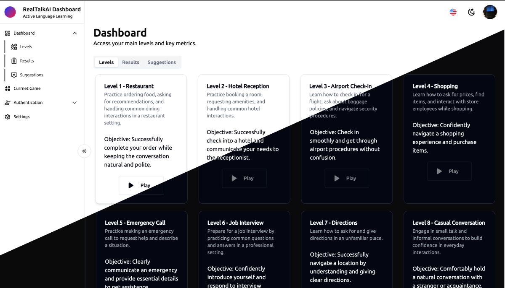

## RealTalkAI

Live-demo: [RealTalkAI](https://learn.realtalk.quest).

### Immersive Conversations for Active Language Learning

Practice real-world conversations in a dynamic, AI-powered environment. Enhance your language skills with interactive scenarios, instant feedback, and personalized learning insights.

  

### Master Languages Faster

Engage in immersive, AI-driven conversations that simulate real-world scenarios. Get instant feedback, improve fluency, and gain confidence—all in an interactive virtual environment.

## Features

RealTalkAI allows you to practice real-world conversations with AI characters in lifelike scenarios. The app offers AI-driven feedback, lifelike voices, and personalized progress tracking to help you build practical language skills faster.

## How It Works

1. **Step Into Real Conversations**  
   Enter a VR-powered environment and engage in realistic conversations designed to challenge and improve your speaking skills.

2. **Practice with AI-Powered Characters**  
   Interact naturally with AI-driven voices that respond in real-time, providing an authentic and dynamic language learning experience.

3. **Get Instant Feedback**  
   Receive AI-generated insights on fluency, grammar, and vocabulary, helping you track progress and refine your skills.

4. **Apply Personalized Suggestions**  
   Use tailored tips and real-world examples to strengthen your language abilities and gain confidence in any scenario.
